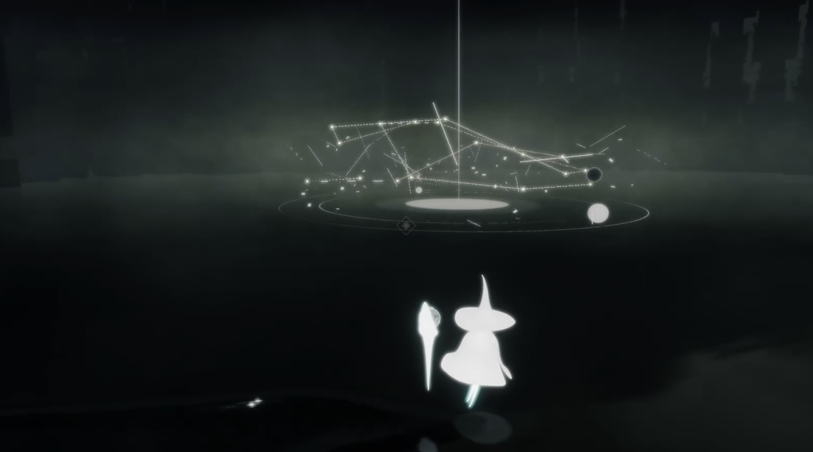

# Game-ZiikyII-3D

# Demo Video

###### Dev log [https://space.bilibili.com/12757615/channel/seriesdetail?sid=1137420]

I'm currently working on a 3D first person rouge-like game using Unity and Blender. This game is a 3D version of my 2nd year university 2D game C++ project. It is about a witch surviving from evil creatures using spells. The game contains action game play element where the witch is enable to use short range combat spell, long range and AOE spells, teleport, time freezing spell and so on during the play. The spells are inspired by constellation.

During the development, I have implemented some core features and systems such as ability system to control when to learn, swap and upgrade a spell; level system to control the random dungeon with configs, environment generator (basic PCG), cameras controller (switching between free look and shoulder cameras, post-processing effect), generic enemy FSM, scriptable enemy/ability configs. I currently make the animation simple and have no sound design at this stage.

I also created lots of shaders (by shader programming and visualization tool) and VFX for some environment objects (the game is currently kinda textureless) and most of my spell effects.

During the development I also found some useful add-ons such as a math library to handle complex motion transformation and mesh subdivision library to dynamically subdivide models for PCG and rendering.
